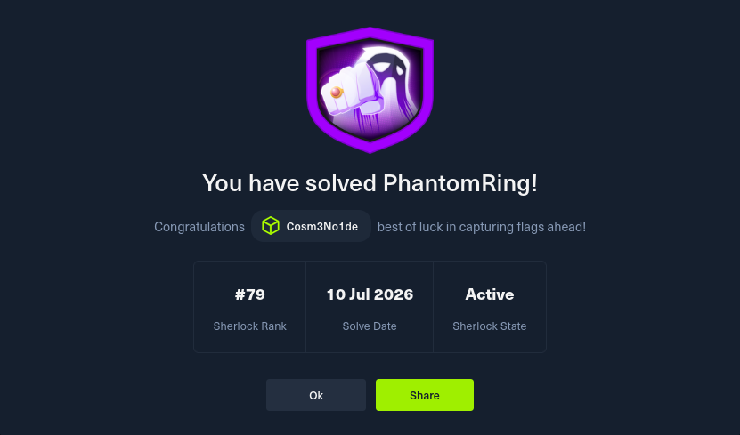

Markdown

<div align="center">



# 🕷️ PhantomRing | Threat Intelligence & Static Analysis Report

[](#)
[](#)
[](#)

*Documentación técnica de ingeniería inversa, análisis estático avanzado y extracción de IoCs de un implante ELF.*

</div>

---

> [!WARNING]
> **Protocolo OPSEC & HTB Integrity:** > Este reporte de inteligencia de amenazas contiene *spoilers* directos (flags/IoCs) del escenario activo. Para preservar el valor didáctico del reto, los indicadores críticos han sido encapsulados en bloques colapsables. Úsese estrictamente como referencia metodológica.

## 📋 Resumen Ejecutivo

**PhantomRing** es una investigación focalizada en un artefacto malicioso de tipo ELF operando en entornos Linux. Este documento detalla la metodología quirúrgica empleada para realizar un análisis puramente estático (sin detonación del malware), logrando diseccionar la infraestructura de Comando y Control (C2), las rutinas de evasión de defensas (manipulación de telemetría eBPF y ftrace) y los vectores de escalada de privilegios locales.

## 🛠️ Arsenal Analítico (GNU Binutils)

Para el triaje y la extracción de artefactos se desplegó el siguiente conjunto de utilidades estándar:
- `sha256sum`: Identificación unívoca y generación de huellas criptográficas.
- `strings`: Extracción de cadenas ASCII/Unicode para análisis de ofuscación e infraestructura.
- `objdump`: Desensamblado de rutinas críticas y análisis del flujo de ejecución en código máquina.
- `nm`: Enumeración y perfilado de la tabla de símbolos (capacidades del backdoor).
- `grep`: Filtrado de patrones mediante expresiones regulares (RegEx).

---

## 🔬 Desglose Operacional y Extracción de IoCs

### T1: Identidad Criptográfica (SHA256)
**Objetivo:** Generar el identificador único del payload para consultas en plataformas de Threat Intel (ej. VirusTotal).
**Metodología:**
```bash
sha256sum agent

T2: Infraestructura C2 (Dirección IP)

Objetivo: Extraer la IP del servidor de comando hardcodeada en la sección de datos legibles.
Metodología:
Bash

strings agent | grep -E -o '([0-9]{1,3}[\.]){3}[0-9]{1,3}'

T3: Infraestructura C2 (Puerto de Exfiltración TCP)

Objetivo: Identificar el puerto destino de la conexión reversa analizando la inicialización del socket (htons).
Metodología:
Bash

objdump -d agent | grep -B2 'call.*htons@plt'
# Análisis: El valor cargado en %edi es 0x115d (Hexadecimal) -> 4445 (Decimal)

T4: Comportamiento de Balizamiento (Sleep Time)

Objetivo: Determinar la latencia (beaconing rate) entre intentos fallidos de conexión al C2.
Metodología:
Bash

objdump -d agent | grep -B2 'call.*sleep'
# Análisis: El valor pasado a sleep() es 0x78 (Hexadecimal) -> 120 (Decimal)

T5: Capacidades del Agente (Comandos Soportados)

Objetivo: Cuantificar el alcance de las directivas integradas perfilando las funciones cmd_.
Metodología:
Bash

nm agent | grep ' T cmd_' | wc -l

T6: Evasión de Defensas EDR (Interfaz Kernel)

Objetivo: Detectar la API del kernel abusada para encolar syscalls asíncronas y evadir hooks tradicionales.
Metodología:
Bash

strings agent | grep -i 'uring'

T7: Enumeración Local (Sesiones de Usuario)

Objetivo: Identificar el artefacto del sistema consultado para mapear presencia humana en la máquina.
Metodología:
Bash

strings agent | grep -E '^/var/'

T8: Escalada de Privilegios (Vectores SUID)

Objetivo: Descubrir el directorio objetivo escaneado en busca de binarios con el bit Set-User-ID activo.
Metodología:
Bash

strings agent | grep '/bin'

T9: Anti-Análisis (Detección de Telemetría eBPF)

Objetivo: Identificar la firma buscada en /proc/[pid]/maps para alertar sobre monitoreo eBPF (Cilium/Sysdig).
Metodología:
Bash

strings agent | grep 'anon_inode'

T10: Sabotaje Activo (Ceguera de Kernel Tracing)

Objetivo: Determinar el pseudo-archivo manipulado en debugfs para apagar el anillo de registro ftrace.
Metodología:
Bash

strings agent | grep '/sys/kernel/debug'

T11: Conocimiento Situacional (Self-Resolution)

Objetivo: Identificar el symlink del procfs leído por el malware para ubicar su propia ruta absoluta en disco.
Metodología:
Bash

strings agent | grep '/proc/self'

T12: Control Operacional (Trigger de Autodestrucción)

Objetivo: Revelar la directiva (C2 command) que invoca la rutina de limpieza (unlink) borrando el binario del sistema.
Metodología:
Bash

strings agent | grep 'destruct'

Threat Research & Walkthrough by cosmenoide dev 🥷
Happy Hacking. Stay stealthy.
